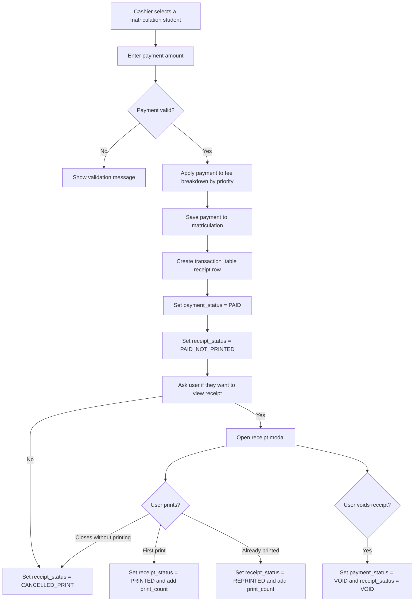

# Matriculation Receipt Status Tracking

This records the database changes used by the matriculation payment receipt flow.

## Flow



## Table Changes

### `transaction_table`

Added columns:

```sql
ALTER TABLE transaction_table
    ADD COLUMN IF NOT EXISTS payment_status varchar(50) NOT NULL DEFAULT 'PAID' AFTER remark,
    ADD COLUMN IF NOT EXISTS receipt_status varchar(50) NOT NULL DEFAULT 'PAID_NOT_PRINTED' AFTER payment_status,
    ADD COLUMN IF NOT EXISTS print_count int(11) NOT NULL DEFAULT 0 AFTER receipt_status,
    ADD COLUMN IF NOT EXISTS printed_at timestamp NULL DEFAULT NULL AFTER print_count,
    ADD COLUMN IF NOT EXISTS cancelled_print_at timestamp NULL DEFAULT NULL AFTER printed_at,
    ADD COLUMN IF NOT EXISTS voided_at timestamp NULL DEFAULT NULL AFTER cancelled_print_at,
    ADD COLUMN IF NOT EXISTS updated_at timestamp NULL DEFAULT NULL ON UPDATE current_timestamp() AFTER created_at;
```

Reasons:

- `payment_status`: records whether the payment transaction is still valid (`PAID`) or has been invalidated (`VOID`).
- `receipt_status`: records the receipt lifecycle: `PAID_NOT_PRINTED`, `PRINTED`, `REPRINTED`, `CANCELLED_PRINT`, or `VOID`.
- `print_count`: records how many times the receipt was printed, so reprints are visible.
- `printed_at`: records when the latest print or reprint was performed.
- `cancelled_print_at`: records when the cashier/user closed or skipped printing.
- `voided_at`: records when the receipt was voided.
- `updated_at`: records the latest lifecycle update time.

### `matriculation`

Added columns:

```sql
ALTER TABLE matriculation
    ADD COLUMN IF NOT EXISTS latest_transaction_id int(11) DEFAULT NULL AFTER payment_status,
    ADD COLUMN IF NOT EXISTS receipt_status varchar(50) NOT NULL DEFAULT 'PAID_NOT_PRINTED' AFTER latest_transaction_id;
```

Reasons:

- `latest_transaction_id`: links the matriculation payment row to the latest generated receipt number.
- `receipt_status`: gives the matriculation module a quick way to know the latest receipt state without scanning the transaction history.

### `receipt_counter`

Added columns:

```sql
ALTER TABLE receipt_counter
    ADD COLUMN IF NOT EXISTS last_issued_transaction_id int(11) DEFAULT NULL AFTER counter,
    ADD COLUMN IF NOT EXISTS updated_at timestamp NULL DEFAULT NULL ON UPDATE current_timestamp() AFTER created_at;
```

Reasons:

- `last_issued_transaction_id`: records the last receipt number issued from the cashier's assigned counter.
- `updated_at`: records when the counter moved, which helps trace receipt number assignment problems.

## Implementation Notes

- The backend also runs these `ALTER TABLE ... ADD COLUMN IF NOT EXISTS` statements defensively before the matriculation receipt endpoints use the new columns.
- Existing `remark` values are still updated for compatibility with the current transaction history display.
- `transaction_table` is the main receipt lifecycle record. `matriculation.receipt_status` is only a quick latest-status copy.
